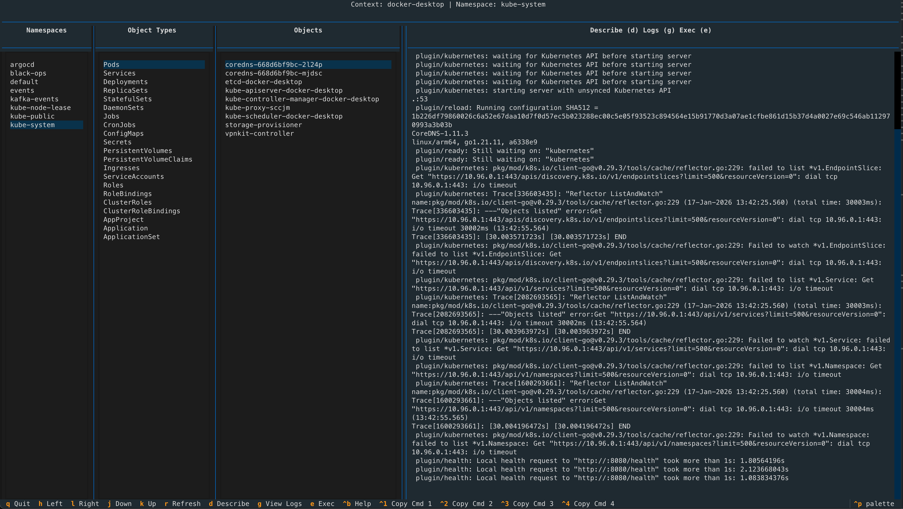
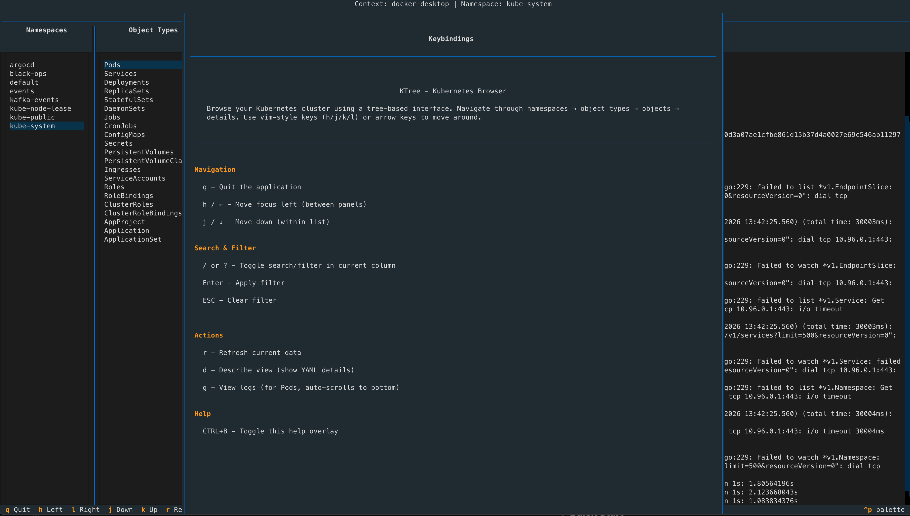

# KTree - Kubernetes Browser

A full-screen CLI application for browsing Kubernetes clusters using a tree-based interface with vim-style navigation.

## Screenshots

### Main Application



### Help Overlay



## Features

### Features
- 🌳 Tree-based navigation through Kubernetes resources
- ⌨️ Vim-style keybindings (h, j, k, l) and arrow keys
- 🎯 Browse namespaces → object types → objects → details
- 📋 View object details (Describe view)
- 📜 View pod logs with auto-scroll to bottom
- 🚀 Exec commands displayed in formatted boxes with clipboard copy (CTRL+1-4)
- 🔄 Works with your current kubeconfig context
- 🔍 Search/filter functionality with visual indicators
- ⌨️ Help overlay (CTRL+B) with all keybindings
- 🎨 Dynamic column width adjustment
- 🎯 Cascading selection on startup for immediate data display
- ⚡ Async data loading with background workers for responsive UI
- 📊 Loading states ("Loading data...") and empty states ("No items") with disabled columns
- 🚀 Non-blocking UI - navigation remains smooth even during data fetching

## Requirements

- Python 3.9 or higher
- Access to a Kubernetes cluster (via kubeconfig)

## Quick Start

> **Note**: On macOS and some Linux distributions, you'll need to use a virtual environment due to externally-managed Python environments.

### Option 1: Using Make (Recommended)

```bash
# Create virtual environment and install dependencies
make venv-install
source venv/bin/activate

# Run the application
make run

# Or with a specific Kubernetes context
ktree --context my-context

# Enable debug logging (writes to debug.log)
ktree --debug
```

### Option 2: Using Scripts

```bash
# Create virtual environment
./scripts/create_venv.sh
source venv/bin/activate

# Install package in development mode
pip install -e .

# Run
ktree
# or
python -m ktree.main
```

### Option 3: Manual Setup

```bash
# Create virtual environment
python3 -m venv venv
source venv/bin/activate

# Install dependencies
pip install -r requirements.txt

# For development, also install dev dependencies
pip install -r requirements-dev.txt

# Install package
pip install -e .

# Run
python -m ktree.main
```

## Development

### Setup Development Environment

```bash
# Create virtual environment
make venv-install
# or
./scripts/create_venv.sh
source venv/bin/activate

# Install with dev dependencies
make install-dev
```

### Available Make Commands

```bash
make help          # Show all available commands
make deps          # Install dependencies
make install       # Install package
make install-dev   # Install with dev dependencies
make run           # Run the application
make test          # Run tests
make lint          # Run linters
make format        # Format code with black
make check         # Format and lint
make clean         # Clean build artifacts
make build         # Build distribution packages
```

### Code Quality

```bash
# Format code
make format

# Lint code
make lint

# Format and lint
make check
```

## Building Distribution Packages

```bash
# Build wheel and source distribution
make build

# Or use the script
./scripts/build.sh
```

Distribution packages will be created in the `dist/` directory.

## Installation Scripts

- `scripts/create_venv.sh` - Create and setup virtual environment
- `scripts/install.sh` - Install the package (dev/user/system)
- `scripts/build.sh` - Build distribution packages

## Project Structure

```
ktree/
├── ktree/                    # Main package
│   ├── __init__.py
│   ├── main.py              # Main application entry point
│   ├── app.py               # Textual app implementation
│   ├── k8s_manager.py       # Kubernetes client wrapper
│   ├── widgets/             # Custom widgets
│   │   ├── column.py        # BrowserColumn widget
│   │   ├── help.py          # HelpOverlay widget
│   │   └── custom_option_list.py  # HighlightedOptionList widget
│   └── styles.css           # Textual CSS styles
├── scripts/                 # Helper scripts
├── tests/                   # Test files
├── requirements.txt         # Python dependencies
├── requirements-dev.txt     # Development dependencies
├── pyproject.toml          # Modern Python project config
├── Makefile                # Build and development commands
├── plan.md                 # Development roadmap
└── README.md               # This file
```

## Command Line Options

- `--context CONTEXT` - Kubernetes context to use (default: current context)
- `--namespace NAMESPACE` - Initial namespace to select (default: first namespace)
- `--type TYPE` - Initial object type to select (e.g., Pods, Services)
- `--debug` - Enable debug logging to `debug.log` file

## Keybindings

### Navigation
- `q` - Quit the application
- `h` / `←` - Move focus left (between panels)
- `j` / `↓` - Move down (within list)
- `k` / `↑` - Move up (within list)
- `l` / `→` - Move focus right (between panels)
- `/` or `?` - Toggle search/filter in current column or details panel
- `r` - Refresh current data

### Details Panel (for Pods)
- `d` - Switch to Describe view (shows YAML details)
- `g` - View logs (auto-scrolls to bottom)
- `e` - Show exec commands in formatted boxes
- `CTRL+1` - Copy first exec command to clipboard
- `CTRL+2` - Copy second exec command to clipboard
- `CTRL+3` - Copy third exec command to clipboard
- `CTRL+4` - Copy fourth exec command to clipboard

### Help
- `CTRL+B` - Toggle help overlay

## Development Roadmap

See [plan.md](plan.md) for detailed development phases and next steps.

## Troubleshooting

### "externally-managed-environment" Error

If you see this error when installing dependencies, you need to use a virtual environment:

```bash
python3 -m venv venv
source venv/bin/activate
pip install -r requirements.txt
```

### No Kubernetes Cluster Access

The app will connect to your default Kubernetes context from `~/.kube/config`. Make sure:
- You have a valid kubeconfig file
- Your current context is set correctly
- You have access to the cluster

## License

This project is licensed under the MIT License - see the [LICENSE](LICENSE) file for details.

## Contributing

Contributions are welcome! Please read our [Contributing Guide](CONTRIBUTING.md) for details on our code of conduct and the process for submitting pull requests.

